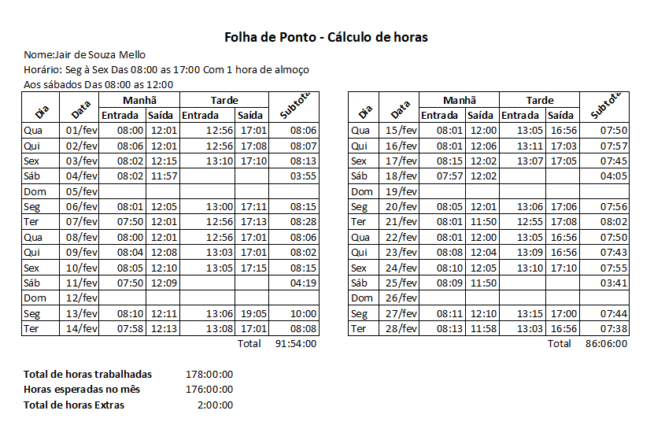
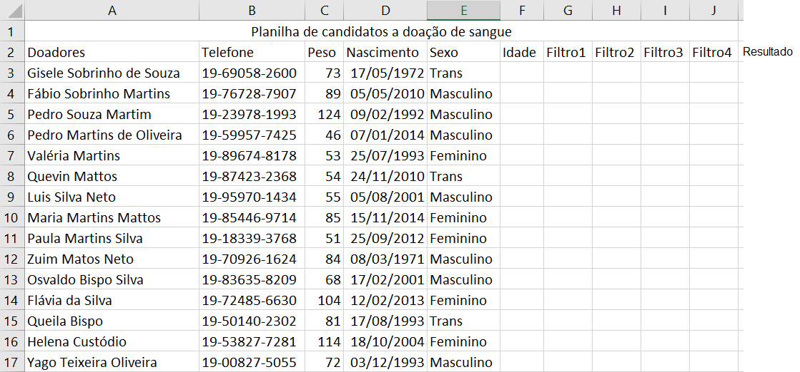
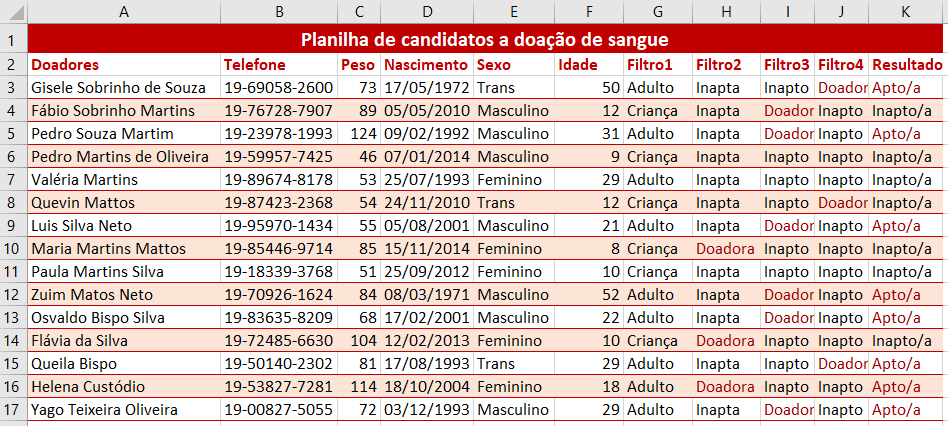

# Excel - Aula02 (Cálculos com data e hora)
- CTRL + ; => Data Atual
- CTRL + Shift + ; => Hora Atual
# Atividade 1

# Atividade 2

## Instruções
- Filtro 1: Somente adulos podem doar sangue, por isso o primeiro filtro é a idade
    - Se a idade form maior ou igual a 18 anos "Adulto" senão "Criança"
- Filtro 2: Mulheres só doam sangue se pesarem 55kilos ou mais você deve preencher as células desta coluna com "Dadora" ou "Inapta"
- Filtro 3: Homens só doam sangue se pesarem 50kilos ou mais você deve preencher as células desta coluna com "Doador" ou "Inapto"
- Filtro 4: Trans só doam sangue se pesarem 50kilos ou mais você deve preencher as células desta coluna com "Doador" ou "Inapto"
- Resultado: Se em alguns dos filtros aparacer "Doador" ou "Doadora" e "Adulto" esta coluna deve ser preenchida como "Apto/a" senão "Inapto/a".
