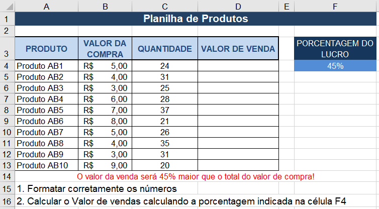
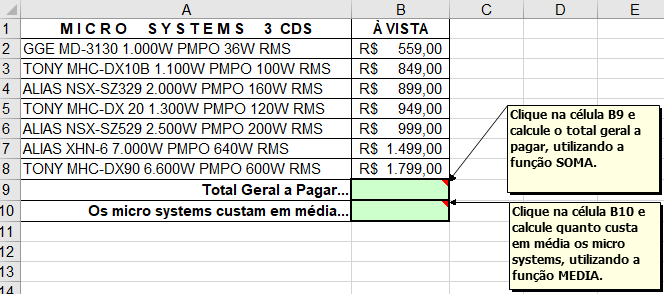
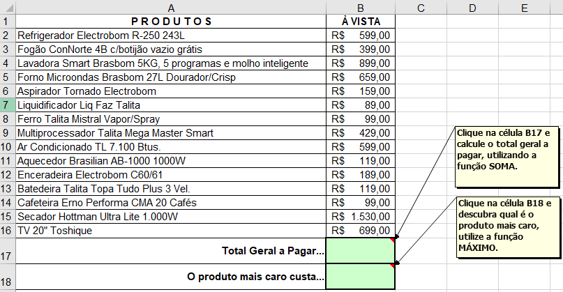
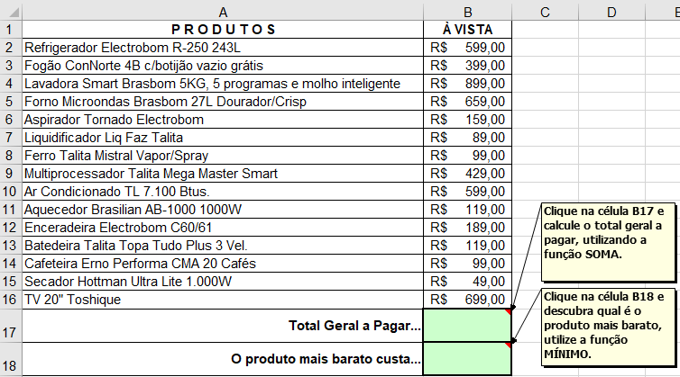
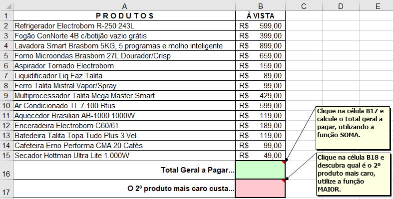
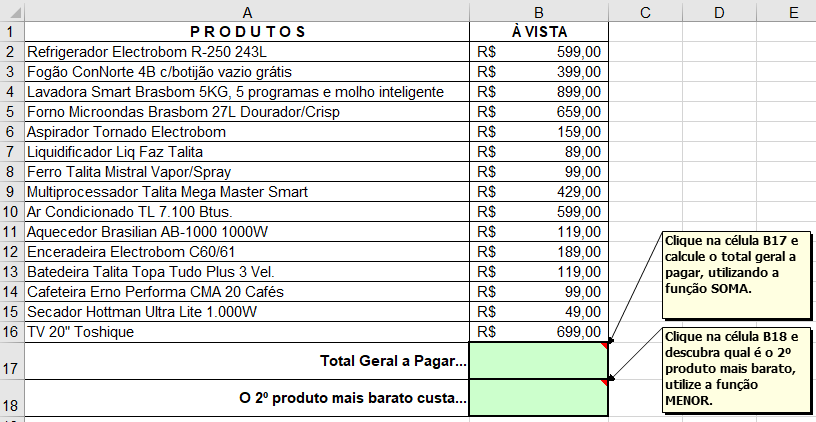
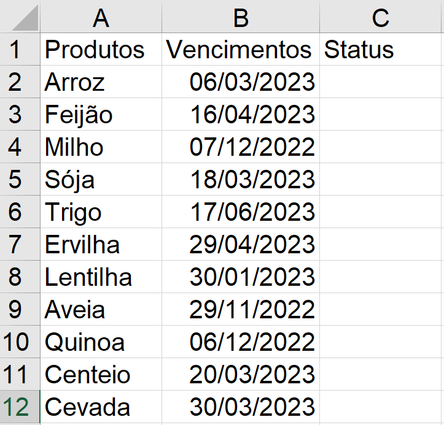

# Excel - Aula03
- Atividades com fórmulas e funções
## Exercícios:
### Exercício 1 - Cálculo com porcentágem:

### Exercício 2 - Função Média:

### Exercício 3 - Função Máximo:

### Exercício 4 - Função Mínimo:

### Exercício 5 - Função Maior:

### Exercício 6 - Função Menor:

### Exercício 7 - Função Hoje, cálculos com datas:

## Função SE()
### Sintaxe SE(Teste Lógico; Se sim; Senão)
||A|B|
|-|-|-|
|1|35|28|
### Exemplo SE(A1 <= B1; "Grande"; "Pequeno")
