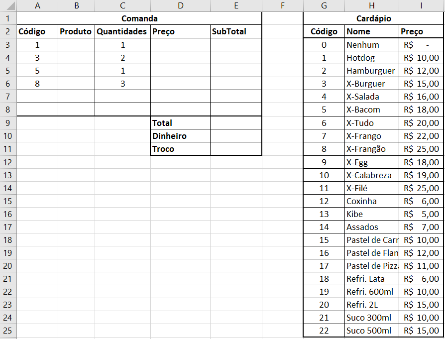
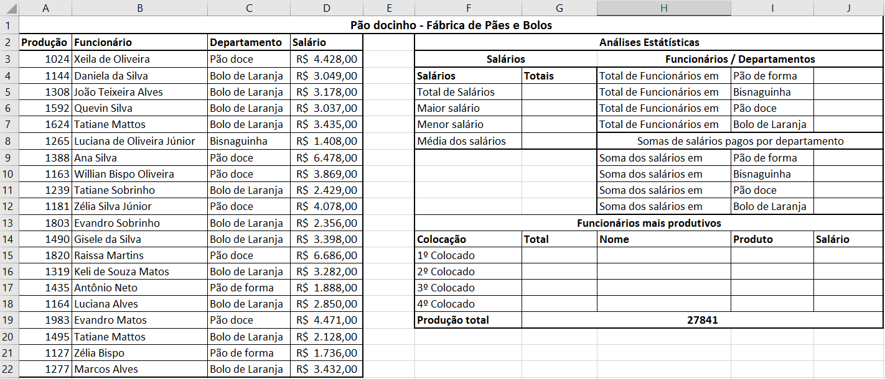

# Excel aula 07 - Mais funções estátísticas
## Lanchonete do Jair
- Funções: *Procv()* ou *ÍNDICE()* e *CORRESP()*
|Contextualização|
|-|
|Seu Jair possui uma lanchonete e um computador no caixa, precisa de um sistema que calcule suas comandas, segue o exemplo:|

- 1. Na coluna "B" insira uma fórmula que procure o **nome** do produto a partir do seu **código**.
- 2. Na coluna "D" insira uma fórmula que procure o **preço** do produto a partir do seu **código**.
- 3. Na coluna "E" Calcule o subtotal multiplicando o o preço pela **quantidade**.
- 4. Calcule o total da comanda.
- 5. Caso seja pago com dinheiro calcule o troco.

## Fábrica de pães e bolos
- Funções *cont.se()*, *somase()*, *procv()* ou *índice()* e *corresp()*
|Contextualização|
|-|
|Sra Joana é gestora de uma fábrica de pãe e bolos, precisa analizar os dados de produção e salário de sua empresa para melhorar a performance de seus funcionários:|

- 1. Calcule as estatísticas dos salários (Total, maior, menor e média)
- 2. Conte quantos funcionários trabalham em cada departamento.
- 3. Some os salários pagos em cada departamento.
- 4. Calcule o ranking dos 4 primeiros colocados em produção, procure o nome, produto/departamento e salário dos 4 ranqueados.
