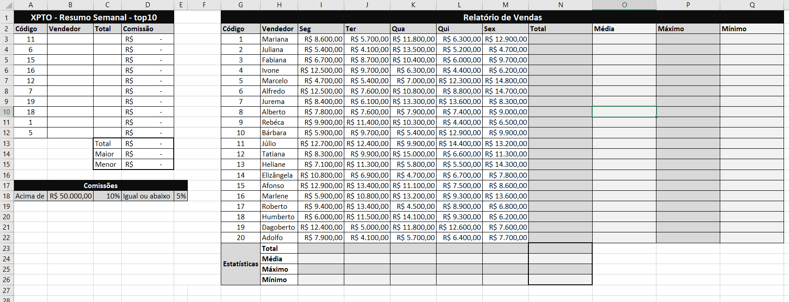
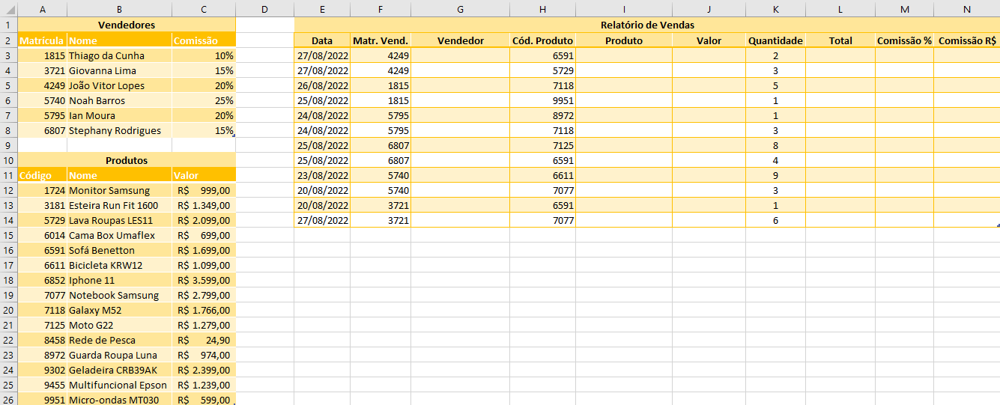
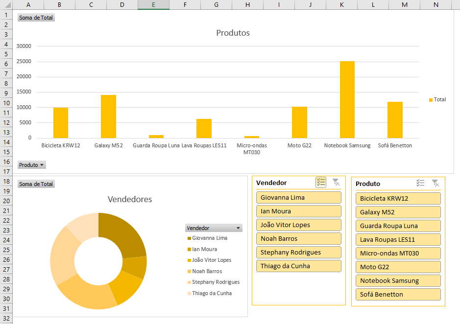

# Avaliação Somativa de Excel
## Atividade 1
- Abra uma nova pasta de trabalho do excel e digite a planilha a seguir:
  
- Ao concluir a digitação formate os dados, valores em reais, bordas, cores a sua escolha:
    - 10% Cooncluído
- Calcule as estátísticas por funcionário colunas (N, O, P e Q) somente até a linha "22"
    - 20% Concluído
- Calcule as estatísticas por dia da semana (Total, Média, Máximo e Mínimo) somente até a coluna "M"
    - 30% Concluído
- Calcule as estatísticas do Total "coluna N" (Soma(), Média(), Máximo() e Mínimo())
    - 35% Concluído
- Preencha a coluna "B" com os nomes dos vendedores:
  - Utilize a função PROCV() ou INDICE() e CORRESP()
    - 40% Concluído
- Preencha a coluna "C" com os totais de cada vendedor
  - Utilize a função PROCV() ou INDICE() e CORRESP()
    - 45% Concluído
- Na coluna "D" calcule a comissão de cada vendedor seguindo a regra das comissões descrita na linha 18. Se utilizar a função SE() corretamente 50%.
- Nas célula A20 coloque o nome do Vendedor com a Maior comissão
- Nas célula A21 coloque o nome do Vendedor com a Menor comissão

## Atividade 2
- Abra uma nova aba/planilha do excel e digite a planilha a seguir:
  
- Preencha a coluna "G" Vendedor com os nomes dos vendedores (Procv ou indice/corresp)
- Preencha a coluna "I" Produto com os nomes dos produtos (Procv ou indice/corresp)
- Preencha a coluna "J" Valor com os valores dos produtos (Procv ou indice/corresp)
- Calcule o Total (Coluna L) multiplicando o calor pela quantidade
- Preencha a coluna "M" Comissçao % com as porcentagens de cada vendedor (Procv ou indice/corresp)
- Calcule a Comissão R$ (coluna N)
Concluido 80%
- Crie um DashBoard semelhante ao da imagem a seguir:
    - Com dois gráficos dinâmicos
        - Em um selecione o vendedor e o Total
        - No outro selecione o Produto e o Total
    - Insira Segmentação de dados (Produto e Vendedor) e vincule os dois gráficos
    - Oculte as linhas de grade

  