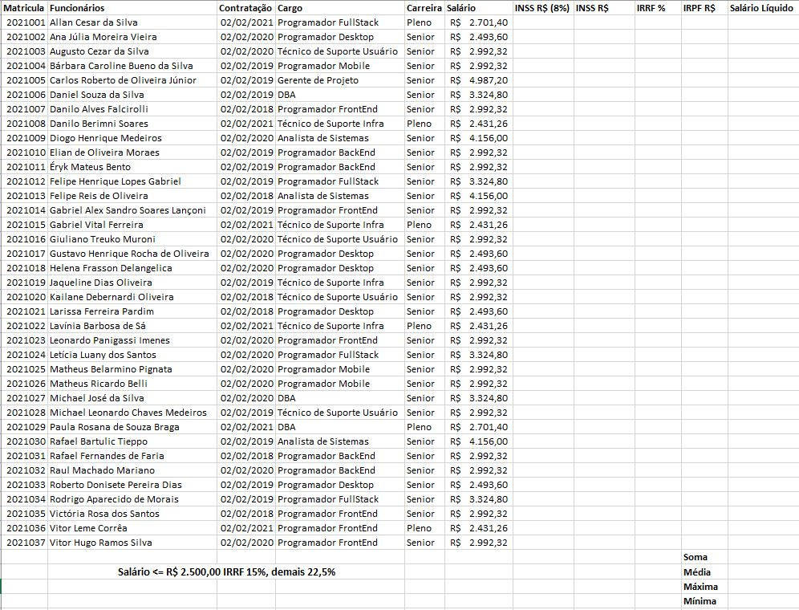

# Recuperação - Excel (Planilhas eletrônicas)
- Digite a planilha a seguir:
 
- Calcule o **INSS R$ (8%)** preenchendo a coluna com **8%**
- Calcule o **INSSR$** multiplicando a porcentagem pelo **Salário**
- Calcule o **IRRF %** utilizando a função SE() para salários menores ou iguais a 2500,00 15% senão 22,5%
- Calcule o **IRRF R$** multiplicando a porcentagem pelo **Salário**
- Calcule o **Salário Líquido** subtraíndo o **INSS R$** e o **IRRF R$** do **Salário**
- Ao final calcule as **estatísticas** (total, média, maximo e mínimo) sobre o **Salário Líquido**
