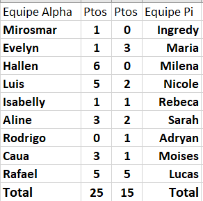

# Atividade 2
- Com base no exemplo de botões e links crie:
    1. Uma apresentação dom 6 perguntas
    2. O tema é livre, de conhecimentos gerais
    3. Crie os botões e links
    4. Aplique design e efeitos de transição e animação
    5. Ao final da apresentação um colega será sorteado para responder suas perguntas e você irá responder as dele.
- Quadro de acertos da atividade:
