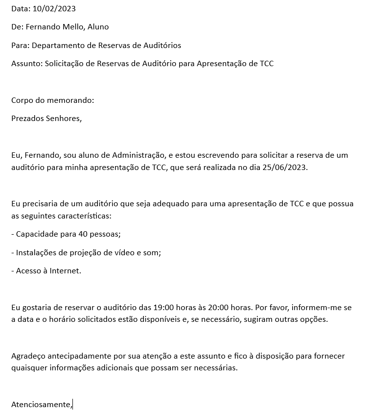
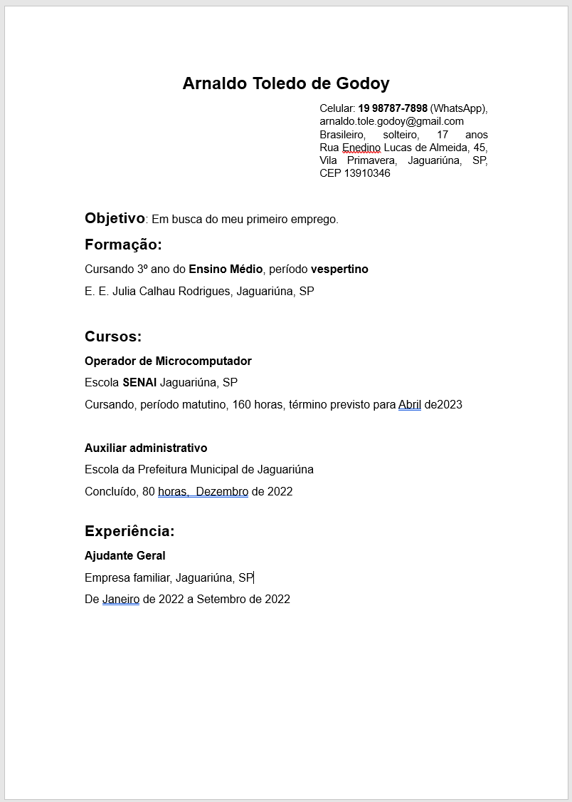

# Edição de Textos
- Básico de edição de texto: 
	- iniciando o Word;
	- apresentando a interface do Word;
	- criar um novo arquivo e digitar; guardar um texto;
	- navegar no texto;
	- selecionar letra, palavra, linha; fechar o Open Office;
	- Manipulação de arquivo de texto:
	- Digitar texto;
	- diferenciando guardar de guardar como;
	- ver página;
- Formatação de textos:
	- caracteres;
	- parágrafo;

# Atividade:
- Abra o Word e digite o texto a seguir:
- 
- Ao concluir a digitação, salve em "Documentos" com o nome de Memorando

# Currículo
- Exemplo de currículo de jovem iniciante no mercado de trabalho.
- 